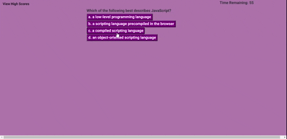

# JavaScript-Quiz

## Description
This simple quiz on JavaScript tests the user's knowledge of the programming language. They will start at 75 seconds to answer 10 questions and depending on the answers being right or wrong, time will be added or taken away. The score will be the time remaining at the end.

This has been constructed using vanilla JavaScript by manipulating the DOM and uses local storage to store high scores.

## Visuals

## Repository / Deployment
Repository is located [here](https://github.com/awpdev/JavaScript-Quiz).

This has been deployed [here](https://awpdev.github.io/JavaScript-Quiz/).
## Installation

## Usage

## Questions
Please refer to my [Github](https://github.com/awpdev/).

Contact me via [email](mailto:apark999@gmail.com) with your inquiries.

## Credits

mcqspdfs.blogspot.com/2013/08/60-top-javascript-multiple-choice.html
https://github.com/sudheerj/javascript-interview-questions
https://www.youtube.com/watch?v=DFhmNLKwwGw
Trilogy Education Services example code

## License
This is under ISC.